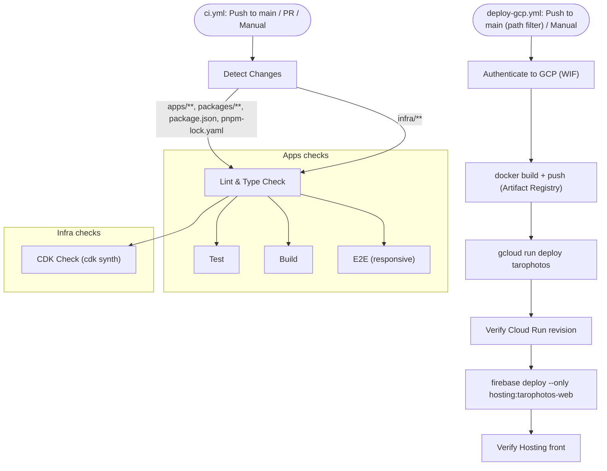

# CI/CD Pipeline Specification

This document describes the overview and specifications of the CI/CD pipeline for this project: checks (`.github/workflows/ci.yml`) and deployment (`.github/workflows/deploy-gcp.yml`).

> **Last Updated**: 2026-09-23
> **Target Workflows**: `.github/workflows/ci.yml`, `.github/workflows/deploy-gcp.yml`

## Overview

The pipeline is split into two independent workflows:

| Workflow | Role | Deploys? |
|----------|------|----------|
| `ci.yml` (**CI**) | Lint / type check / unit test / build / e2e / `cdk synth` | **No** — checks only |
| `deploy-gcp.yml` (**Deploy to GCP (Cloud Run + Firebase Hosting)**) | Build the container, deploy to Cloud Run, deploy Firebase Hosting config | Yes (production) |

> History: `ci.yml` used to contain Amplify / CDK deploy jobs. Amplify was retired (production moved to Cloud Run on 2026-07-25, app deleted on 2026-09-01), and those jobs have been removed.

### Key Features

- **Change Detection**: `ci.yml` runs only the jobs relevant to the changed paths.
- **Manual Trigger**: both workflows support `workflow_dispatch`.
- **Keyless Deploy**: `deploy-gcp.yml` authenticates with GitHub Actions OIDC → GCP Workload Identity Federation. No GitHub Secrets are required by either workflow.
- **Fail-closed runtime config**: the deploy stops if the `SES_AWS_ROLE_ARN` repository variable is unset.

---

## Pipeline Flow

---

## `ci.yml`: Change Detection (Detect Changes)

Uses `git diff` to check for differences against the previous commit (or base branch for PRs) and sets the following flags.

| Flag | Target Path | Description |
|--------|---------|------|
| `apps` | `apps/**`, `packages/**`, `package.json`, `pnpm-lock.yaml` | Application code changes |
| `infra` | `infra/**` | AWS CDK (SES identity) code changes |

### Manual Execution

When triggered manually (`workflow_dispatch`), flags are forcibly overwritten based on the `target` input parameter. (The input is labelled "Target to deploy" for historical reasons; it only selects which checks run.)

- **`all`**: `apps=true`, `infra=true`
- **`apps`**: `apps=true`, `infra=false`
- **`infra`**: `apps=false`, `infra=true`

---

## `ci.yml`: Job Details

### 1. Lint & Type Check
- **Condition**: `apps` or `infra` flag is true
- **Content**: `pnpm lint`, then `pnpm build` as the type check.

### 2. Test
- **Condition**: `apps` flag is true (after Lint & Type Check)
- **Content**: `pnpm test` (Vitest).

### 3. Build
- **Condition**: `apps` flag is true (after Lint & Type Check)
- **Content**: `pnpm build`, and uploads `apps/web/.next` as the `build-output` artifact (7 days).

### 4. E2E (responsive)
- **Condition**: `apps` flag is true (after Lint & Type Check)
- **Content**: Installs Playwright Chromium + WebKit and runs `pnpm --filter @repo/web exec playwright test` (builds and serves internally). Uploads `playwright-report` on failure.

### 5. CDK Check
- **Condition**: `infra` flag is true (after Lint & Type Check)
- **Content**: Runs `npx cdk synth` in `infra/`.
- **Note**: Uses dummy values (`SES_FROM_EMAIL=synth-only@example.com`, `CDK_DEFAULT_ACCOUNT=123456789012`, `CDK_DEFAULT_REGION=ap-northeast-1`) so synth runs without secrets. Without `SES_FROM_EMAIL` / `SES_DOMAIN`, no stack is synthesized and `cdk synth` fails.

### No Deploy Job

`ci.yml` intentionally has no deploy job:

- Application deploys are handled by `deploy-gcp.yml` (below).
- `infra/` is **not** applied from CI. The stack name `SesStack` collides with the i-willink.com stack in the same AWS account/region, so a `cdk deploy` from here could overwrite that site's production SES identity. It is not deployed until the name collision is resolved (see the comment at the end of `ci.yml` and the [Deployment Guide](deployment.md#infrastructure-in-this-repository-infra)).

---

## `deploy-gcp.yml`: Deployment

### Trigger

- **Push to `main`** that changes `apps/web/**`, `packages/**`, `Dockerfile`, `firebase.json`, `.github/workflows/deploy-gcp.yml` or `pnpm-lock.yaml`
- **Manual**: `workflow_dispatch` (no inputs)

Runs are serialized with `concurrency: gcp-deploy-main` (`cancel-in-progress: false`).

### Steps

| Step | Content |
|------|---------|
| Authenticate to GCP (WIF) | Provider `projects/626363975800/locations/global/workloadIdentityPools/github/providers/github-oidc`, SA `tarophotos-deployer@iwillink-web.iam.gserviceaccount.com` |
| Setup gcloud / Configure docker auth | `gcloud auth configure-docker asia-northeast1-docker.pkg.dev` |
| Build image / Push image | `docker build` → `asia-northeast1-docker.pkg.dev/iwillink-web/web/tarophotos:<commit SHA>` |
| Deploy to Cloud Run | Fails if `vars.SES_AWS_ROLE_ARN` is empty; `gcloud run deploy tarophotos` with the runtime SA, port 8080, 1 CPU / 512Mi, 0–2 instances, `--allow-unauthenticated`, and `--update-env-vars` for the SES variables |
| Verify Cloud Run revision serves (live) | Service URL returns HTTP 200 and contains `ds-wrap` |
| Deploy Firebase Hosting (rewrite config) | `npx firebase-tools@14 deploy --only hosting:tarophotos-web --project iwillink-web --non-interactive` |
| Verify Hosting front (live) | `https://tarophotos-web.web.app/` returns HTTP 200 and contains `ds-wrap` |

---

## Configuration

### GitHub Secrets

None are required by `ci.yml` or `deploy-gcp.yml`. (AWS access keys, `GH_PAT`, `AMPLIFY_APP_NAME`, `REPO_NAME` and `DOMAIN_NAME` were used only by the removed Amplify / CDK deploy path and are no longer needed.)

### GitHub Repository Variables (used by `deploy-gcp.yml`)

| Variable Name | Description |
|--------|------|
| `SES_REGION` | AWS region for SES |
| `SES_FROM_EMAIL` | Sender address |
| `SES_TO_EMAIL` | Contact form notification recipient |
| `SES_AWS_ROLE_ARN` | AWS role for web identity federation (**required**; the deploy fails closed if unset) |

---

## Guide: Manual Execution

### Re-run checks (`ci.yml`)

1. Open the **Actions** tab in the GitHub repository.
2. Select the **CI** workflow from the left sidebar.
3. Click the **Run workflow** button.
4. **Branch**: Select the branch to check.
5. **Target**: Select the checks to execute (`all`, `apps`, `infra`).
6. Click **Run workflow**.

### Re-deploy production (`deploy-gcp.yml`)

1. Open the **Actions** tab in the GitHub repository.
2. Select **Deploy to GCP (Cloud Run + Firebase Hosting)**.
3. Click **Run workflow** on `main`.

See the [Deployment Guide](deployment.md) for details, including rollback.
